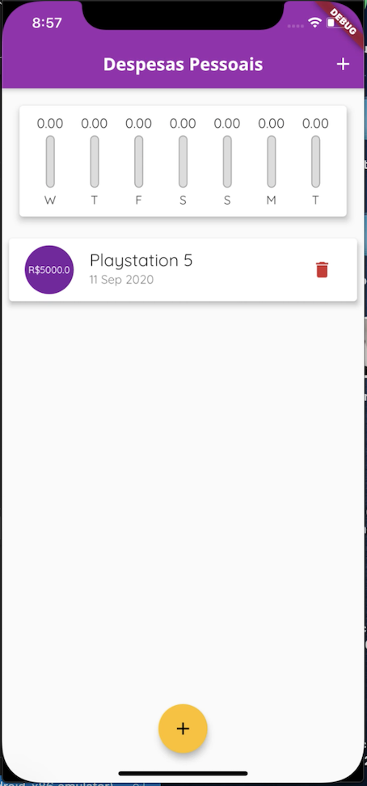

# Projeto despesas pessoais.

Esse projeto é o segundo de uma série de projetos que serão desenvolvidos durante os próximos meses.

Requisitos do projeto:

1. Adicionar uma despesa pessoal a lista.
2. Renderizar as despesas na tela utilizando widgets do flutter.
3. Criar um gráfico e calcular a porcentagem gasta em cada dia da semana.
4. Criar um modal para receber os inputs.
5. Garantir a funcionalidade tanto em IOS quanto em Android.

Conceitos exercitados:

1. Criação de layouts utlizando widgets.
2. Manipulação de listas.
3. Conceitos básicos de dart.
4. Ajustes para ambas plataformas.

Resultado final:

## Getting Started

This project is a starting point for a Flutter application.

A few resources to get you started if this is your first Flutter project:

- [Lab: Write your first Flutter app](https://flutter.dev/docs/get-started/codelab)
- [Cookbook: Useful Flutter samples](https://flutter.dev/docs/cookbook)

For help getting started with Flutter, view our
[online documentation](https://flutter.dev/docs), which offers tutorials,
samples, guidance on mobile development, and a full API reference.
